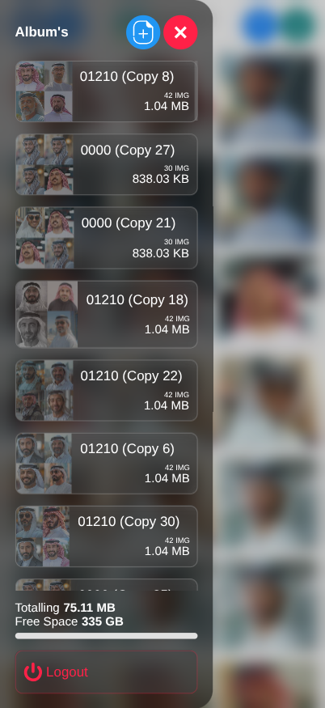

## 📸 Home Server for Storing Images with a Gallery




🖼️ A clean and responsive **Flask-based image gallery** where you can **upload**, **view**, **download (📥)**, and **delete (🗑️)** images. Supports **bulk selection** and **zip downloads** with a modern UI.

---

### ✨ Features

* 🚀 Upload multiple images at once
* 📂 Browse images in a responsive grid
* ✅ Multi-select images with a single click
* 📥 Download selected images as a `.zip` file
* 🗑️ Delete selected images instantly
* 🔍 Fullscreen lightbox with zoom, pan & swipe
* 📱 Mobile-friendly iOS-style action bar

### ⚙️ Installation

- Open CMD 🖥️


| **Operating System** | **Steps**                                                                                                                   |
|----------------------|-----------------------------------------------------------------------------------------------------------------------------|
| **Windows** 💻        | 1. Press `Windows + R` to open the "Run" dialog box. <br> 2. Type `cmd` and hit `Enter`. <br> 3. The Command Prompt (CMD) will open. <br> Alternatively, you can search for "Command Prompt" in the Start menu and click to open it. 🔍 <br> 4. To navigate to the Desktop, type `cd %USERPROFILE%\Desktop` and hit `Enter`. 📂        |
| **Linux** 🐧          | 1. Press `Ctrl + Alt + T` to open the terminal. <br> 2. Alternatively, search for "Terminal" in your applications menu. 💨 <br> 3. To navigate to the Desktop, type `cd ~/Desktop` and hit `Enter`. 📂        |


1️⃣ **Clone the repository**

```bash
git clone https://github.com/LaithALhaware/Gallery-Home-Server.git
cd Flask-Image-Gallery
```

2️⃣ **Create a virtual environment & install dependencies**

```bash
python -m venv venv
source venv/bin/activate   # Windows: venv\Scripts\activate
pip install flask
```

3️⃣ **Run the app**

```bash
python app.py
```

4️⃣ **Open in browser**

```
http://127.0.0.1:5022/
```

---

### 📂 Project Structure

```
Flask-Image-Gallery/
├── app.py                 # Flask backend
├── templates/
│   └── index.html         # Gallery UI
│   └── Login.html         # Login UI
├── static/
│   ├── Uploads/           # Uploaded images
│   └── screenshots/       # Screenshots for README
└── README.md
```

---

### 🛠️ Tech Stack

* **Backend:** Flask (Python)
* **Frontend:** HTML5, CSS3, Vanilla JS
* **Storage:** Local file system

---

## 📝 License
This project is licensed under the **License**. See the [LICENSE.txt](LICENSE.txt) ⚖️ file for details.

---
## ❤️ Support This Project
If you find this project useful, consider supporting its development:

💰 Via PayPal: [[PayPal Link](https://www.paypal.com/ncp/payment/KC9EETJDVZQHG)]

Your support helps keep this project alive! 🚀🔥
